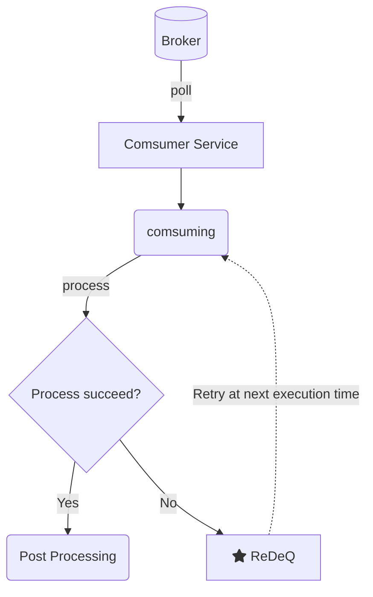
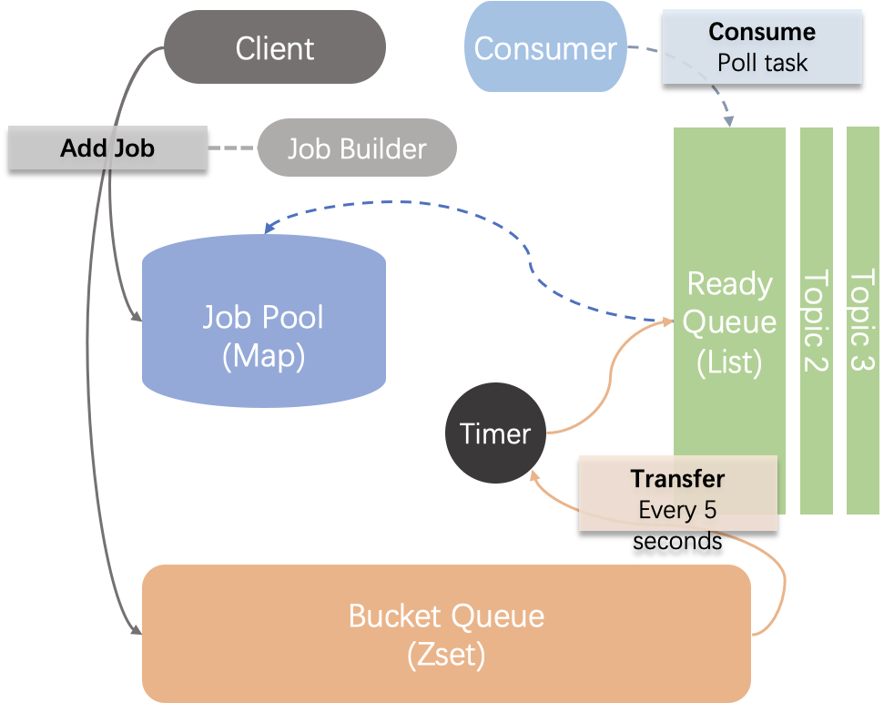
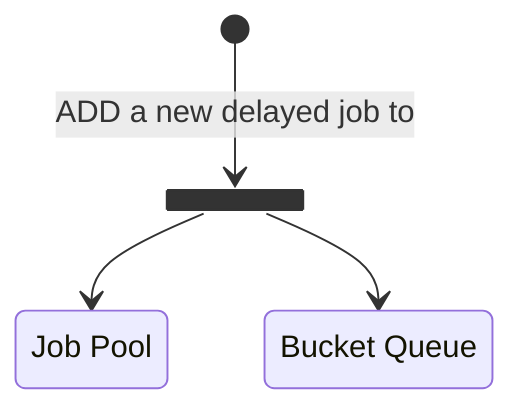
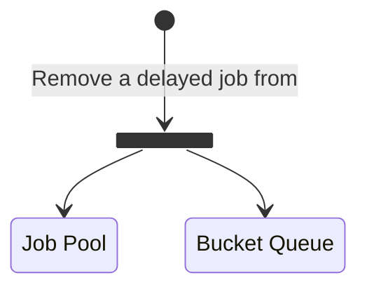
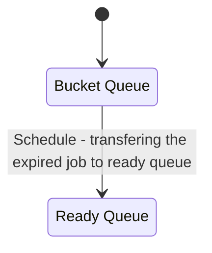
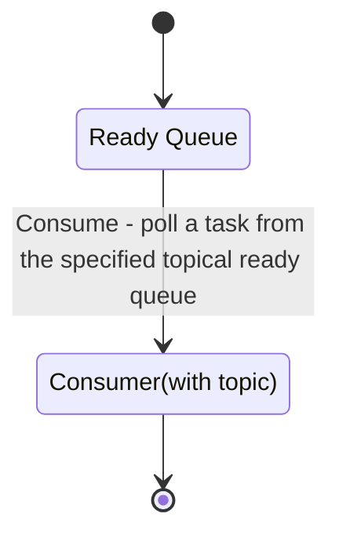

<div align="center"><p>
    <span style="font-size: 14px">Version: 1.1.1-ALPHA</span><br>
    <span>"ReDeQ - 另一个基于Redis的延迟队列"</span><br>
    <span style="font-size: 12px;color= #95dafc">-- Created by <a>Kevin T. Lee</a> --</span>
    </p>
   <a href="./License"></a>
        <!--<a href="http://lidengju.com"></a>-->
    <a href="https://github.com/kevinleeex/redeq"></a>
</div>

# ReDeQ - Yet Another Redis Delayed Queue

另一个基于Redis的延迟队列

> 作者：Li, Dengju，字数：2606，预计花费时间：15分钟

- [ReDeQ - Yet Another Redis Delayed Queue](#redeq---yet-another-redis-delayed-queue)
   * [Overview](#overview)
   * [Implementation](#implementation)
   * [Features](#features)
   * [Installation](#installation)
   * [Usage](#usage)
      + [with spring-boot](#with-spring-boot)
         - [Dependency](#dependency)
         - [Config](#config)
         - [Example](#example)
      + [without spring-boot](#without-spring-boot)
   * [Design](#design)
      + [Service Diagram](#service-diagram)
      + [ReDeQ-Design](#redeq-design)
      + [Components](#components)
      + [State Diagram](#state-diagram)
   * [FAQ](#faq)
   * [References](#references)
   * [License](#license)

## Overview

我们可能经常面临如需要多少分钟后延迟重试任务，多少分钟后消息或邮件通知用户，或者一段时间后取消任务、订单或者变更状态等类似需求。显然，我们可以通过JDK中的`TimerTask
`来直接设定定时任务，但是这样并不方便我们对已执行或准备执行的任务进行很好的管理，也不适合在分布式场景下对大量的对象设置定时任务。在这样的需求场景下，延迟队列可以派上用场，目前有这样的几种方案来实现延迟队列：

1. 基于JUC包中的延迟队列(`DelayQueue`)，它是一个无界阻塞队列(`BlockingQueue`)，本质封装了一个基于完全二叉堆优先队列(`PriorityQueue`)
   ，实现较小元素（较近的时间）排在队首，并且限制了可以出队的时间，以实现延迟队列。
2. 基于Quartz定时任务实现，在Redis和RabbitMQ没有广泛实现的时候，常使用这种方式实现。
3. 基于Redis的Zset数据结构实现延迟队列的效果，可以将待执行时间作为score来进行排序，通过获取特定范围score的数据进行消费以实现延迟队列。
4. 基于RabbitMQ来实现延迟队列，通过设置消息的存活时间(Time To Live, TTL)，以及死信交换机制，来实现当消息过期时，将其转发到指定队列重新消费。
5. 同样利用过期机制，Redis可以为key设置过期回调，来实现监听Key的过期事件，从而实现延迟重新消费。
6. 基于哈希时间轮盘算法(HashedWheelTimer)，如在Netty的心跳监测实现中使用了这种方案的延迟队列，基于JUC中的DelayQueue，多了一层轮盘算法封装。

本中间件基于Redis实现延迟队列，期望设计分布式环境下安全、易用、高效的延迟队列实现，并提供给用户便捷的接口来对延迟队列进行操作。我将此延迟队列中间件命名为ReDeQ`['redik(ju:)]`。

## Implementation

- Java 8
- redisson 3.16.1
- spring-boot 2.3.4
- redis server 5.0.3
- gson 2.8.5
- slf4j 1.7.25

## Features

- [x] 支持参数自动配置开箱即用
- [x] 准实时性，基于定时扫描频率
- [x] 高性能，支持多topic延迟队列消费
- [x] 可靠性，延迟队列重试机制，保证至少一次消费
- [x] 支持分布式集群、单机，使用Redisson分布式锁进行资源控制
- [x] 重试机制
- [x] 容量限制
- [x] 增删作业时的命令批量执行
- [x] 优雅结束服务
- [ ] 消费能力心跳监测（当实例不具备消费能力时，应考虑降级处理，避免造成消息积压）
- [ ] 完善的客户端（支持取消订阅主题、查看延迟队列元素等功能）

## Installation

```shell
mvn clean compile install
```

## Usage

### with spring-boot

See `redeq-spring-boot-example` example project. 

#### Dependency

添加如下依赖

```xml
<dependency>
    <groupId>com.lidengju</groupId>
    <artifactId>redeq-spring-boot-starter</artifactId>
    <version>1.1.1-ALPHA</version>
</dependency>
```

#### Config

```yaml
redeq:
  # 配置redis连接信息，配置后会注入RedissonClient，默认集群模式
  redis:
    hosts: 127.0.0.1:7001,127.0.0.1:7002,127.0.0.1:7003,127.0.0.1:7004,127.0.0.1:7005,127.0.0.1:7006 # redis hosts, 逗号分隔, 用于配置redisson
    password: p@33word # redis password
  # 下面非必须配置
  app:
    prefix: "" # 应用前缀，用于redis键前缀
    verbose: false # 是否打印冗余日志
    delay: 60 # 默认任务延迟时间，单位秒，默认60秒
    retry: 3 # 默认重试次数，默认3次
    schedule: 5 # 扫描延迟队列时间，默认5秒，减少提高实时性
    poll-queue-timeout: 5 # 默认从桶队列迁移作业到就绪队列的等待时间，默认5秒
    max-pool: 500000 # 作业池的最大容量，超过将抛出JOB_POOL_EXCEEDED异常，默认50万
    max-subscribers: 10 # 最多允许订阅的数量
    concurrency: 1 # 迁移作业的并行量，必须是2的幂
  lock:
    acquire-lock-timeout: 3 # 加锁阻塞时间，默认3秒
    expire-lock-timeout: 20 # 加锁过期时间，默认20秒，过期时间比poll时间长，避免锁提前过期释放
```

#### Example

**添加Redisson配置**(配置redeq.redis可自动注入)

```java
@Configuration
@Slf4j
public class RedissonConfig {
    @Value("${redeq.redis.hosts}")
    private String hosts;
    @Value("${redeq.redis.password:}")
    private String password;

    @Bean
    public RedissonClient redissonClient() {
        Config config = new Config();
        String[] hostArray = Arrays.stream(hosts.split(","))
                .map(x -> "redis://" + x.trim())
                .toArray(String[]::new);
        // redis集群模式 
        config.useClusterServers().addNodeAddress(hostArray);
        log.info("Redis cluster nodes added: {}", Arrays.toString(hostArray));
        return Redisson.create(config);
    }
}
```

**在需要重试的地方添加作业**

```java
public class Service {
    @Autowired
    private RedeqClient redeqClient;

    public void proc(Model model) {
        try {
            firstProc(model);
        } catch (RedeqException e) {
            DelayedJob.Builder delayedJobBuilder = new DelayedJob.Builder();
            DelayedJob job = delayedJobBuilder
                    .withBase(model.getTopic(), model.getId())
                    .withBody(model)
                    .build();
            if (redeqClient.add(job) > 0) {
                continue;
            }
        }
        sencondProc(model);
    }
}
```


**延迟任务消费**

```java
/**
* 消费线程类，对于延迟任务消费情况进行处理
*/
@Component
@Slf4j
public class TestConsumer {
    @Autowired
    private RedeqClient redeqClient;

    @PostConstruct
    private void init() {
        // 当前消费线程要消费的主题
        List<String> topics = Lists.newArrayList("testTopic");
        try {
            redeqClient.subscribe(topics, new AbstractConsumeService() {
                // 必须复写
                @Override
                public boolean onConsume(DelayedJob job) {
                    log.info("正在消费[{}]", job.getTopicId());
                    Model model = (JsonToModel) job.getBody();
                    try{
        							firstProc(model);
                  	} catch(RedeqException e){
                      log.info("first proc failed!");
                      // 返回false重试
                      return false;
                  	}
    								sencondProc();
                    return true;
                }
                
                @Override
                public void onSucceed(DelayedJob job) {
                    log.info("成功后执行");
                }

                @Override
                public void onFailed(DelayedJob job) {
                    log.info("超出重试次数后执行");
                    Model model = (JsonToModel) job.getBody();
                    secondProc(model);
                }

                @Override
                public void onRetry(DelayedJob job) {
                    log.info("添加重试后执行");
                }
            });
        } catch (Exception e) {
            log.error("启动Redeq消费线程失败", e);
        }
    }
}
```

### without spring-boot

See `redeq-example` example project.

TODO 

## Design

### Service Diagram


### ReDeQ-Design




<center>REDEQ设计架构图。<small>Credit: Li, Dengju</small></center>

### Components

- **Job Pool：** 作业池，基于redis中的hash数据结构实现，用于存放一个作业/消息的完整内容，用于消费时根据唯一id获取相应内容；
- **Bucket Queue：** 延迟桶队列，本质为一个优先队列，基于redis中的sorted set数据结构实现，用于按待执行时间对待执行作业进行排序，定时将到期的作业迁移至就绪队列作为任务等待消费；通过对Job的id进行哈希并取余，将其放入特定编码的桶队列中，以实现不同实例并行迁移作业；
- **Ready Queue：** 就绪队列，本质为一个无界单向队列，基于redis中的list数据结构实现，用于存放待消费的任务，供用户的消费线程进行消费；根据Job的topic不同，其会被放入不同的主题就绪队列，以实现多实例并行消费。
- **Timer：** 用于控制从**Bucket Queue** 向**Ready Queue**迁移任务的周期，默认为每5秒，周期越短实时性越高，但是可能会产生性能影响；
- **Client：** 客户端，提供了常用的API来增加作业、删除作业、获取待消费的任务、启动消费线程等；
- **Consumer：** 消费者，提供了模板方法，便于用户编写消费成功、消费重试、消费失败的监听事件的相应处理

### State Diagram



<center>向任务池和延迟队列添加一个延迟任务</center>



<center>从任务池和延迟队列移除一个延迟任务</center>



<center>固定时间周期将到期的延迟任务放入就绪队列</center>



<center>从特定主题就绪队列获取一个任务，没有则阻塞等待</center>

## FAQ

1. 如何多实例部署？

   > ReDeQ依赖Redisson实现的分布式锁进行资源控制，有关redis的运行模式由Redisson进行管理。

2. 作业如何并行消费？

   > 为作业设置不同的Topic，根据实例数增加ReDeQ的`concurrency`数值，作业会根据其jobId，通过hash并对`concurrency`取模后，得到`[0, concurrency)`的下标`n`，其会被路由到`prefix`+`REDEQ:BUCKET`+`n`对应的队列中；注意，此数值减小后，若原本的Bucket Queue还有作业未被消费，则其可能不会被消费，应考虑在重新部署应用手动将原Bucket Queue中的作业迁移到现在的首个队列，如`REDEQ:BUCKET0`中。

3. 作业如何被路由？

   > `DelayedJob`的`srcId`属性（其值等于初始的`jobId`），通过如下哈希取模得到路由下标：
   >
   > ```java
   > // 1. 取绝对值
   > // 2. 通过&与位运算替代取模%，前提是modBy满足(2^n - 1)
   > routeId = (srcId.hashCode() & Integer.MAX_VALUE) & (modBy-1);
   > // 3. 为使modBy满足条件，因此在设置modBy即concurrency的值时，获取其最接近的2的幂
   > // get the closest power of 2 according given number
   > concurrency = Math.max(1, concurrency);
   > concurrency = (int) Math.pow(2, Math.floor(Math.log(concurrency)/Math.log(2)));
   > ```

4. 为什么重试作业需要重命名作业ID？

   > 在**添加**和**删除**作业时，会使用单个作业的`jobId`添加可重入锁，不同作业添加的过程不会产生冲突；但当执行**迁移**操作时，其是对整个迁移过程加锁，本质是执行往**就绪队列**增加和从**桶队列**删除的操作，这个过程不是原子事务执行的，其中可能会有其他指令插入，若不重命名，在根据key删除时，可能会将此key误删除；同理，若插入相同jobId作业，也有可能造成此问题。
   >
   > 若根据score(即时间戳)对**桶队列**进行删除，则要注意由于不同实例的时钟偏移或时间延迟造成误删除。
   >
   > 注意，redis的`zset`数据结构根据**score**删除的时间复杂度为`O(log(N) + M)`，而根据**value**删除的时间复杂度是`O(M * log(N))` M是删除的个数。

## References

- [Redisson参考手册](http://bookstack.cn/read.redisson-wiki-zh)
- [有赞延迟队列](http://tech.youzan.com/queuing_delay)

## License

[MIT](./LICENSE)开源协议
